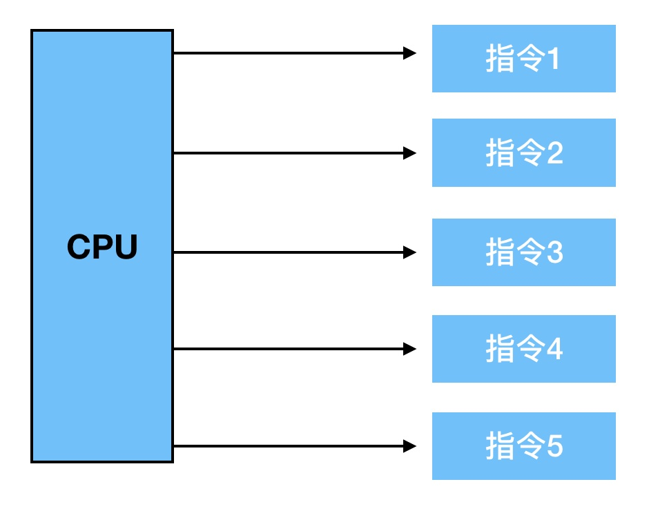
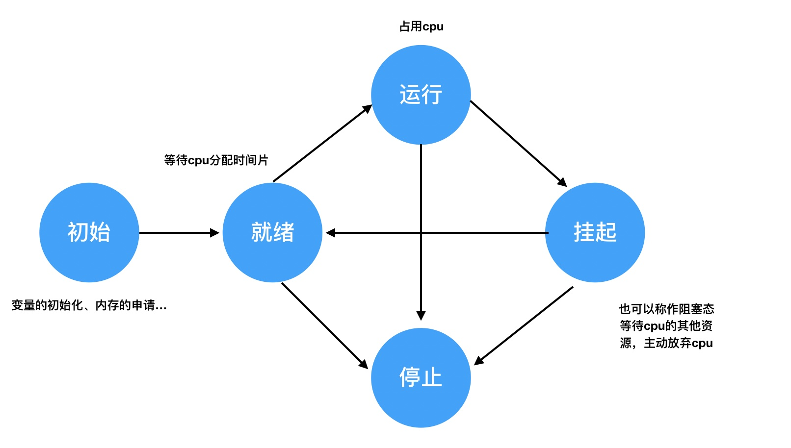

[TOC]

# Goroutine

## 1. 并行和并发

- **并行 (parallel)** ：借助多核CPU实现，在同一时刻，同时执行多条机器指令



- **并发**：多个任务，<font color=red>顺序执行</font>。不断使用cpu时间片切换任务。

  - 进程和程序
    - 程序：编译成功后得到的二进制文件，只占用硬盘存储空间
    - 进程：运行起来的程序。占用系统资源（内存。。。）

  - 进程的状态

    

  - 孤儿进程和僵尸进程
    - 孤儿进程：父进程先于子进程结束，则子进程进孤儿进程。则子进程称为孤儿进程，父进程称为init进程，称为init进程领养孤儿进程
    - 僵尸进程：进程终止，父进程尚未回收，子进程残留资源存放在内核中。

  - 线程并发

    线程：最小的执行单位 ——cpu分配时间轮片的依据

    进程：最小的系统资源分配单位

  - 线程同步

-  并发安全与锁

  - 互斥锁：一种常用的控制共享资源访问的方法，他能够保证同时只有一个goroutine可以访问共享资源

  - 读写互斥锁：分为读锁和写锁。当一个goroutine获得读锁后，其他goroutine如果获得读锁，则不等待，如果获得写锁，则会等待。当一个goroutine获得写锁后，其他goroutine不论获得读锁还是写锁都要等待

    > 运用场景：读操作远远多于写操作，运用读写互斥锁可以极大地提升程序的性能

    goroutine使用时可以配合sync.WaitGroup使用

    ```go
    var wg sync.WaitGroup
    
    func task() {
      // do something
      ....
      wg.Done()			// 任务完成，WaitGroup中的task数减一
    }
    
    func foo() {
      for i:= 0; i < 100l i++ {
        wg.Add(1)		// 每启动一个goroutine，都记录下来，WaitGroup中的task数加一
        go task()
      }
      wg.Wait()			// 阻塞，等待所有的goroutine执行完毕
      ....
    }
    ```

    